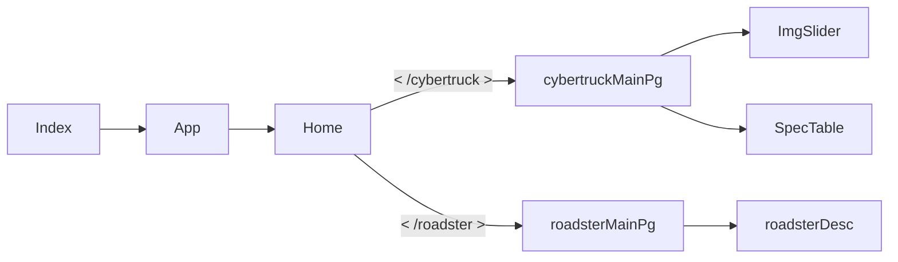

# 테슬라 웹페이지 구현 (Tesla Webpage cloning)
테슬라의 공식홈페이지(https://www.tesla.com/) 를 리액트를 사용하여 구현해보고, 리덕스를 사용해봄으로써 사용 기술을 익히고 효율적인 상태관리를 적용시켜 볼 예정이다.

또한 SPA ( Single Page Application) 웹 구성을 하기 위하여 react-router-dom 을 사용하고, 반응형 웹페이지를 목적으로 개발할 예정이다.

- **기간**
07.21~

- **개발인원**
1 명

- **페이지 구성 (flow chart)** (진행중)

## 사용기술
1. ReactJs
2. react-router-dom 
3. Redux
4. Styled-component
5. react-slick ( for slider )
6. react-reveal ( for page content animation )

## 상세 페이지 (진행 중)
**메인 페이지(Home.js)**

